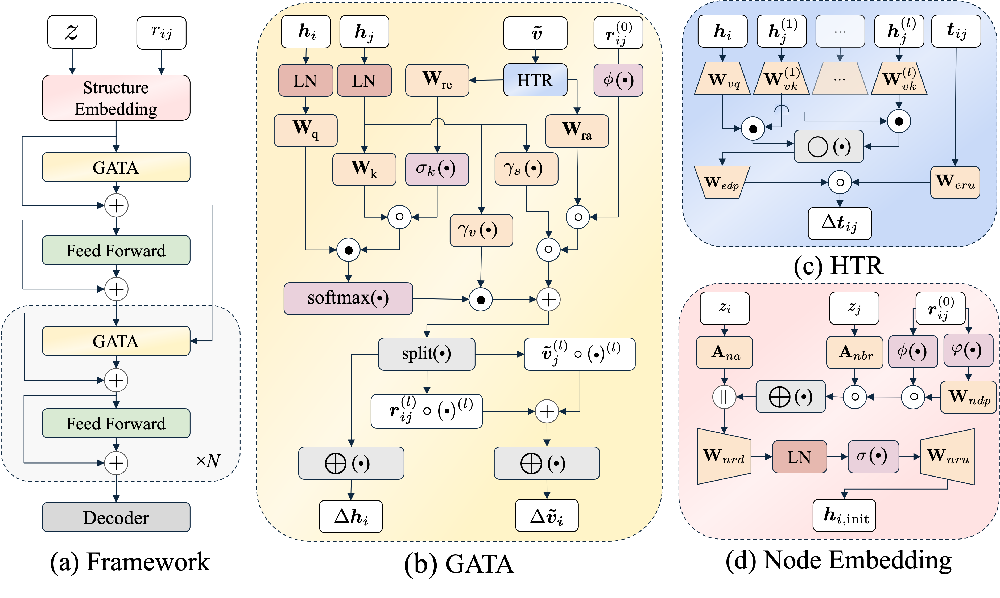

# Rethinking Efficient 3D Equivariant Graph Neural Networks 
This is the official implementation of "Rethinking Efficient 3D Equivariant Graph Neural Networks". 

## Overview

GotenNet is a novel framework for modeling 3D molecular structures that balances expressiveness and efficiency through:

- Leverages effective geometric tensor representations without relying on irreducible representations or Clebsch-Gordan transforms
- Introduces unified structural embedding with geometry-aware tensor attention
- Implements hierarchical tensor refinement for flexible and efficient representations
- Achieves state-of-the-art performance on QM9, rMD17, MD22, and Molecule3D datasets

<p align="center">  </p> 

## Installation

```bash
# Create and activate conda environment
conda create -n gotennet python=3.10
conda activate gotennet

# Install requirements
pip install -r requirements.txt
```

## Project Structure

```
├── configs/               <- Configuration files
│   ├── data/             <- Dataset configs
│   ├── model/            <- Model architecture configs
│   ├── train.yaml        <- Main training config
│   └── eval.yaml         <- Evaluation config
│
├── src/                  <- Source code
│   ├── data/            <- Data processing
│   ├── models/          <- Model implementation
│   └── utils/           <- Utility functions
│
├── scripts/              <- Training and evaluation scripts
└── requirements.txt      <- Python dependencies
```

## Training

Train the model on QM9 dataset for HOMO target prediction:

```bash
python src/train.py experiment=gotennet_u0
```

## Model Configurations

GotenNet comes in three variants:
- Small (S): Lightweight version for quick experimentation
- Base (B): Recommended for most applications
- Large (L): Maximum performance for complex tasks

## Results

Our model achieves state-of-the-art performance across multiple benchmarks:

- QM9: Superior performance in both scalar and vector property prediction
- rMD17: Improved force field predictions
- MD22: Enhanced molecular dynamics simulation accuracy
- Molecule3D: Strong performance in 3D structure prediction

## License

This project is licensed under the MIT License - see the LICENSE file for details.